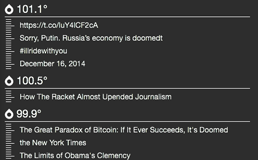

# Fever RSS Hotlinks Widget

Made for [Übersicht](http://tracesof.net/uebersicht/)

This widget pulls hotlinks from your [Fever](http://feedafever.com/) installation and displays them on the desktop.

The widget has been rewritten to provide better error messages for fixing problems you may encounter.

## Options and Installation

Download fever.widget.zip. Unzip it, and drag the fever.widget folder into your Übersicht widgets folder.

You need to add the URL of your Fever installation, your username and password into `fever.coffee`. 

feverURL should be the full URL of fever, in quotations, wihtout a trailing slash, for example: "http://myserver.com/fever" 

feverUser shoudl be the full username, usually an email address in quotations, for example: "me@myEmail.com"

feverPass should be the password for your fever installation, in quotations, for example: "Password"